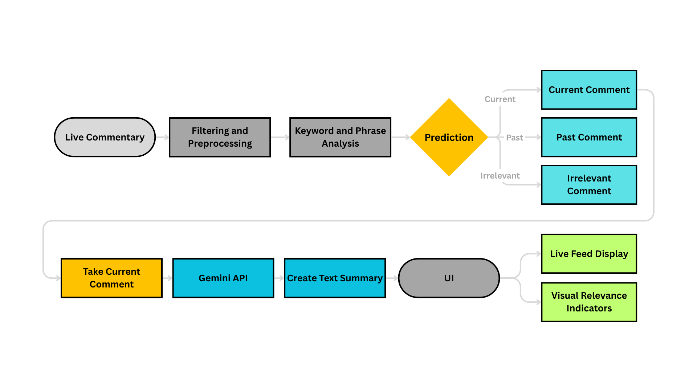
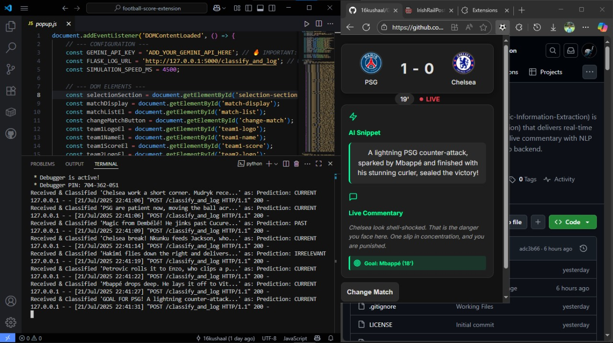

# ⚽ GOALIE – Game-Observations-Analysis-via-Linguistic-Information-Extraction

 **Real-Time Match Insights from Commentators Narration – All in Your Browser.**

GOALIE is a browser extension (designed for Chromium) that simulates real-time football match updates, complete with AI-powered snippet generation, tactical commentary classification, and interactive match displays. It features a sleek UI and integrates with a Flask-based backend that talks to a Gradio-hosted classifier.

---

##  Features

* 🎮 **Live Match Simulation** with realistic minute-by-minute commentary (For Demostartion Purposes)
* 💬 **AI-Generated Snippets** describing the current game state
* 🔍 **NLP Classification** of football commentary using Hugging Face + Gradio
* 🧠 **Event Detection** for goals, fouls, corners, substitutions, and more
* ⚙️ **Configurable Match Data** (currently with limited commentary, in production using SportsMonk API (Extension Under Development))
* 🌙 **Dark Themed UI** with smooth animations and responsive layout

---
### 📊 System Pipeline Diagram



## Tech Stack

| Layer        | Technology                                                       |
| ------------ | ---------------------------------------------------------------- |
| Frontend     | HTML, CSS (custom + variables), JavaScript                       |
| UI Libraries | [Feather Icons](https://feathericons.com/), Google Fonts (Inter) |
| Backend      | Python, Flask, Flask-CORS                                        |
| AI/NLP       | Hugging Face Transformers (via Gradio client)                    |
| Hosting      | Local Flask server + Gradio space endpoint                       |

---
## Model Benchmarking & Evaluation

GOALIE classifies football commentary into 3 categories — `CURRENT`, `PAST`, and `IRRELEVANT` — using supervised NLP techniques.

---

### Dataset

- **Source:** [SoccerNet-Echoes (whisper_v3/en)](https://huggingface.co/datasets/SoccerNet/SN-echoes/viewer/whisper_v3/en)
- **Processed version:** `football_commentary_balanced.csv` (balanced to 50,000 samples/class)
- **Final shape:** 149,981 samples
- **Columns:** `game`, `text`, `label`

> Used only English commentary. Filtered and balanced across the 3 label classes.

---

### Top 10 Model Combinations

| Rank | Model               | Vectorizer          | Accuracy | F1 Score | CV Score (±std) | Time (s) |
|------|---------------------|---------------------|----------|----------|------------------|----------|
| 1    | Logistic Regression | TF-IDF (Char 2-5)   | 0.9966   | 0.9966   | 0.9959 ± 0.000   | 135.03   |
| 2    | Random Forest       | TF-IDF (Char 2-5)   | 0.9873   | 0.9874   | 0.9889 ± 0.001   | 266.37   |
| 3    | Logistic Regression | Count (1-2gram)     | 0.9790   | 0.9790   | 0.9791 ± 0.001   | 21.72    |
| 4    | Logistic Regression | TF-IDF (1-3gram)    | 0.9789   | 0.9789   | 0.9774 ± 0.001   | 17.25    |
| 5    | Logistic Regression | TF-IDF (1-2gram)    | 0.9773   | 0.9773   | 0.9757 ± 0.001   | 15.50    |
| 6    | Random Forest       | TF-IDF (1-2gram)    | 0.9340   | 0.9336   | 0.9351 ± 0.002   | 22.90    |
| 7    | Random Forest       | TF-IDF (1-3gram)    | 0.9332   | 0.9329   | 0.9322 ± 0.000   | 25.37    |
| 8    | Naive Bayes         | TF-IDF (Char 2-5)   | 0.9331   | 0.9328   | 0.9341 ± 0.001   | 108.53   |
| 9    | Random Forest       | Count (1-2gram)     | 0.9315   | 0.9312   | 0.9329 ± 0.001   | 30.64    |
| 10   | Naive Bayes         | TF-IDF (1-3gram)    | 0.8689   | 0.8646   | 0.8640 ± 0.002   | 14.73    |

---

###  Best Performing Model

```text
Model     : Logistic Regression
Vectorizer: TF-IDF (Character-level, 2–5)
Accuracy  : 0.9966
F1 Score  : 0.9966
CV Score  : 0.9959 ± 0.000
```
---

## Setup Instructions

### 1. Clone the repository

```bash
git clone https://github.com/16kushaal/GOALIE-Live-Sports-Extension.git
cd GOALIE-Live-Sports-Extension
```

### 2. Backend Setup (`app.py`)

> ⚠️ Ensure you have Python 3.8+ and `pip` installed.

```bash
pip install Flask Flask-Cors python-dotenv gradio_client
```

Create a `.env` file in the root directory:

```
GRADIO_SPACE=<your_gradio_space_url>
HF_TOKEN=<your_huggingface_token>
```

Then run:

```bash
python app.py
```

Your API will be hosted at `http://127.0.0.1:5000/classify_and_log`

---

### 3. Frontend / Chrome Extension Setup

#### Load Extension

1. Open Chrome → `chrome://extensions`
2. Enable **Developer Mode**
3. Click **Load unpacked** → select the repo folder

> Ensure the following file exists and is correct:

```
manifest.json
```

#### Insert Gemini API Key (Frontend)

In `popup.js`, replace:

```js
const GEMINI_API_KEY = 'ADD_YOUR_GEMINI_API_HERE';
```

with your actual API key, or handle it through a proxy if sensitive.

---

## Project Structure

```
FOOTBALL-SCORE-EXTENSION/
│
├── .venv/                          # Python virtual environment
├── .env                            # Environment variables (Gradio + HuggingFace tokens)
├── README.md                       # Project documentation
├── app.py                          # Flask backend server (text classification + Gradio client)
├── text.txt                        # Match event commentary samples
│
├── football-live-extension/       # Chrome Extension Source
│   ├── manifest.json              # Chrome Extension manifest (v3)
│   ├── popup.html                 # Main popup UI HTML
│   ├── popup.css                  # Extension styling (themed, responsive)
│   ├── popup.js                   # Frontend logic, AI snippet updates, match selection
│   └── images/                    # Logos/icons (48x48, etc.)
│
├── model/                         # ML-related assets
│   ├── data/                      # Labeled and balanced datasets
│   │   ├── football_commentary_labelled.csv
│   │   └── football_commentary_balanced.csv
│   ├── results/                   # Outputs (model + visualizations)
│   │   └── output.png             # Example plot/metric image
│   |── football_classifier_model.pkl
│   ├── dataset.ipynb             # Preprocessing, balancing, and exploration
│   └── model.ipynb               # Training and evaluation of the classifier

```

---

## ⚙️ How It Works

1. **User selects a match** from the popup.
2. Commentary events simulate live match progression every few seconds.
3. Commentary is sent via `fetch()` to Flask (`/classify_and_log`) where:

   * It's processed by a Gradio-hosted transformer model
   * The classification (Current, Past, Irrelevant) is logged and printed
4. The popup UI updates the snippet and events visually based on the result.

---

## Demo Commentary Types

```json
{
  "type": "commentary", "text": "Dembélé hits the post! That was close!"
}
{
  "type": "score", "scorer": "Mbappé", "team": "home", "newScore": [1, 0]
}
{
  "type": "foul", "text": "Yellow card for Caicedo."
}
```

---

## 📋 Todo / Roadmap

* [ ] Add real-time data API support (from SportsMonk)
* [ ] Improve snippet generation using Gemini API (currently simulated)
* [ ] Save commentary logs to a database
* [ ] Add user team preferences and theming
* [ ] Dockerize backend for production deployment

---
###  Working Demo Video
[](https://www.youtube.com/watch?v=809OBu9fc6Q)

---
##  Author

Made with ⚽ and 💻 by [@16kushaal](https://github.com/16kushaal)

---

## 📄 License

Apache-2.0 license. See `LICENSE` for more information.

---
